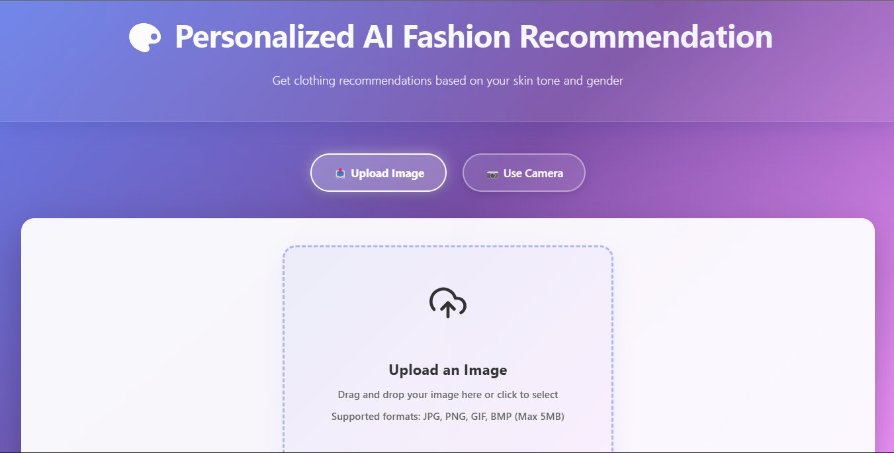
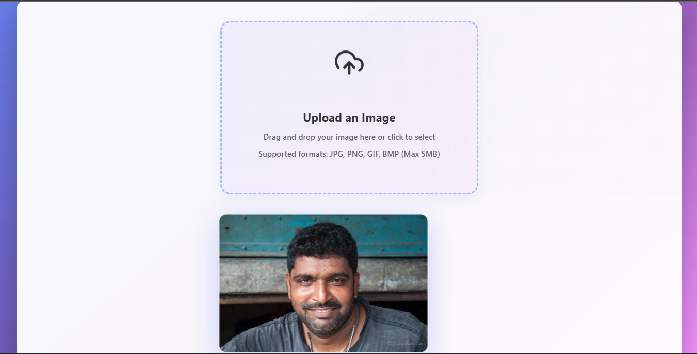
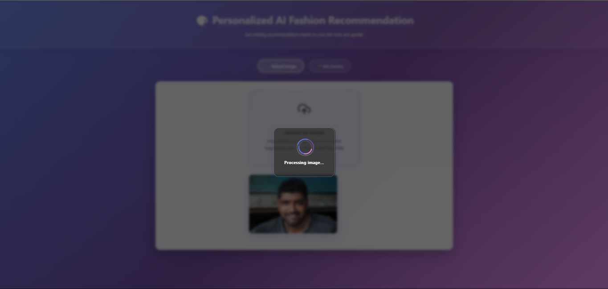
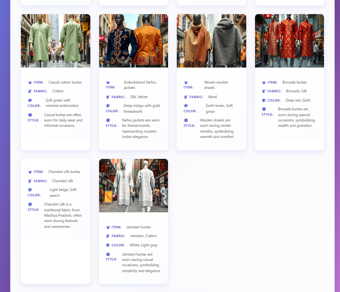

# 🎨 Personalized Fashion Recommendation System

An AI-powered web application that provides personalized clothing recommendations based on user photos, analyzing facial features, skin tone, and gender to suggest suitable fashion choices.

## 📸 Application Preview

### Step 1: Initial Interface

*Landing page of the fashion recommendation system*

### Step 2: Feature Showcase

*Demonstration of the application's core features*

### Step 3: User Interaction

*Interactive elements and user input interface*

### Step 4: Processing

*AI analysis and processing visualization*

### Step 5: Results

*Final recommendations and style suggestions*

## 🌟 Features

- 📸 Real-time camera capture and photo upload
- 👤 Face detection and analysis
- 🎯 Gender detection using machine learning
- 🎨 Skin tone analysis
- 👔 Personalized clothing recommendations
- 📱 Responsive web interface
- 🔄 Real-time processing and results

## 🛠️ Technology Stack

### Frontend
- React.js (^18.3.1)
- Axios for API calls
- React Webcam for camera integration
- CSS for styling
- React Icons for UI elements

### Backend
- Flask (2.3.0)
- TensorFlow (2.13.0)
- OpenCV (4.7.0.72)
- NumPy (1.24.0)
- PIL (Pillow 10.0.0)

## 📋 Prerequisites

- Node.js (v16 or higher)
- Python 3.8+
- pip (Python package manager)
- Web camera (for live capture feature)

## 🚀 Installation

### Model Files Setup

Due to file size limitations, the model files are not included in the repository. Download the required model files from the releases section and place them in the `src/static/models/` directory:

Required models:
- `Gender_Prediction_model.h5`
- `skin_tone_model.h5`
- `res10_300x300_ssd_iter_140000_fp16.caffemodel`
- `deploy.prototxt.txt`

### Backend Setup

1. Create and activate virtual environment:
```bash
python -m venv .venv
# On Windows
.venv\Scripts\activate
# On macOS/Linux
source .venv/bin/activate
```

2. Install Python dependencies:
```bash
pip install -r requirements.txt
```

### Frontend Setup

1. Install Node.js dependencies:
```bash
npm install
```

## 🏃‍♂️ Running the Application

1. Start the Flask backend server:
```bash
python run.py
```
The backend will start at `http://127.0.0.1:5000`

2. Start the React development server (in a separate terminal):
```bash
npm start
```
The frontend will be available at `http://localhost:3000`

## 📁 Project Structure

```
personalised_fashion_recomendation/
├── src/
│   ├── app.py                 # Main Flask application
│   ├── config.py             # Configuration settings
│   ├── components/           # React components
│   │   ├── CameraCapture.jsx
│   │   ├── ImageUpload.jsx
│   │   ├── ResultsDisplay.jsx
│   │   └── ...
│   ├── hooks/               # Custom React hooks
│   │   ├── useCamera.js
│   │   └── useImageProcessor.js
│   ├── utils/              # Utility modules
│   │   ├── model_loader.py
│   │   └── image_processor.py
│   └── static/             # Static assets
│       ├── models/         # ML models
│       ├── css/
│       └── images/
├── data/                   # Data files
│   └── clothing_styles.json
└── docs/                   # Documentation
```

## 🎯 Features in Detail

### 1. Image Capture
- Upload images from device
- Capture photos using webcam
- Real-time camera preview
- Image quality optimization

### 2. AI Analysis
- Face detection using OpenCV
- Gender detection using TensorFlow
- Skin tone analysis
- Clothing style matching

### 3. Recommendations
- Personalized clothing suggestions
- Style categories
- Color recommendations
- Outfit combinations

## 🔒 Security

- Input validation for file uploads
- Secure API endpoints
- No permanent storage of user photos
- CORS protection

## 📝 API Endpoints

- `POST /get_clothing_styles` - Get personalized clothing recommendations
- Additional endpoints documented in the code

## 🐛 Troubleshooting

### Common Issues
1. Camera not working
   - Check browser permissions
   - Ensure camera is not in use by other applications

2. Image upload fails
   - Check file size and format
   - Ensure proper network connection

3. Model loading errors
   - Verify all model files are in correct locations
   - Check Python environment setup

## 🤝 Contributing

1. Fork the repository
2. Create a feature branch
3. Commit your changes
4. Push to the branch
5. Create a Pull Request

## 📄 License

This project is licensed under the MIT License - see the LICENSE file for details.

## 👥 Authors

- [Aryan Raj](https://github.com/AryanDevCodes) - Initial work and maintenance

## 📞 Support

For support and questions, please open an issue in the repository.